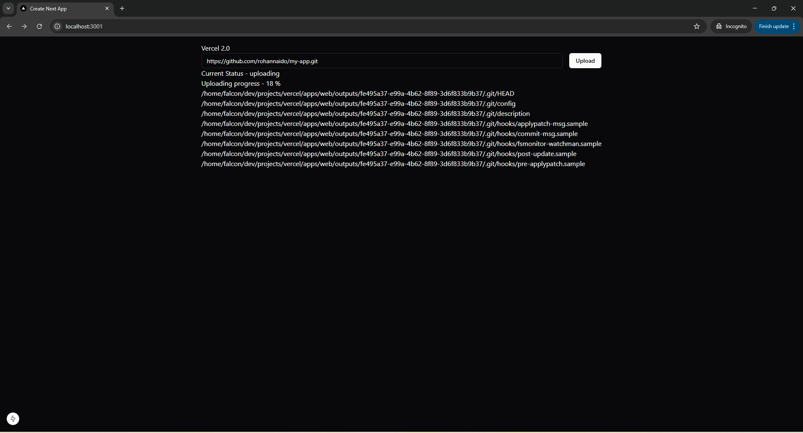
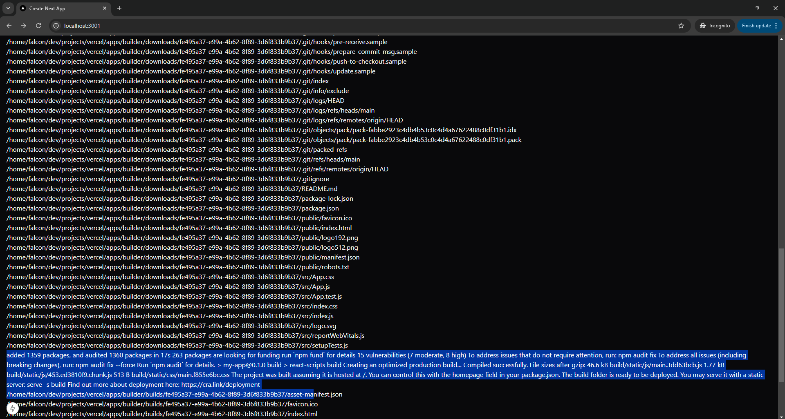
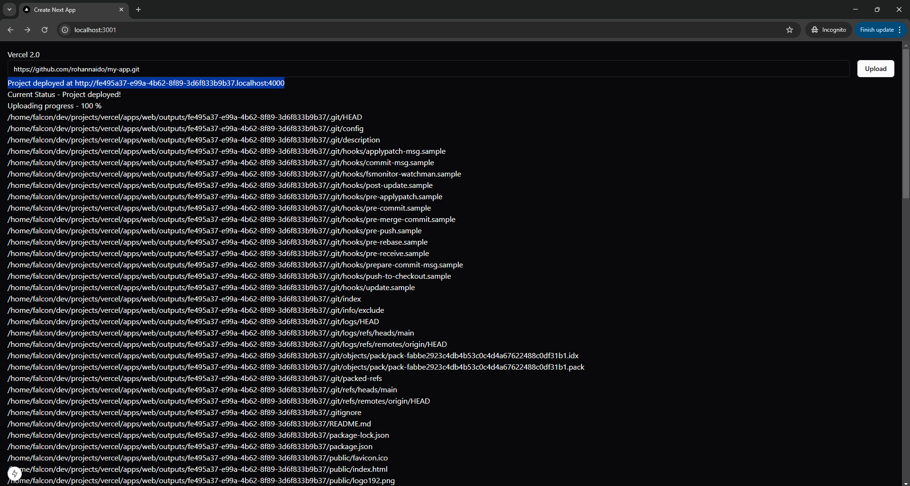
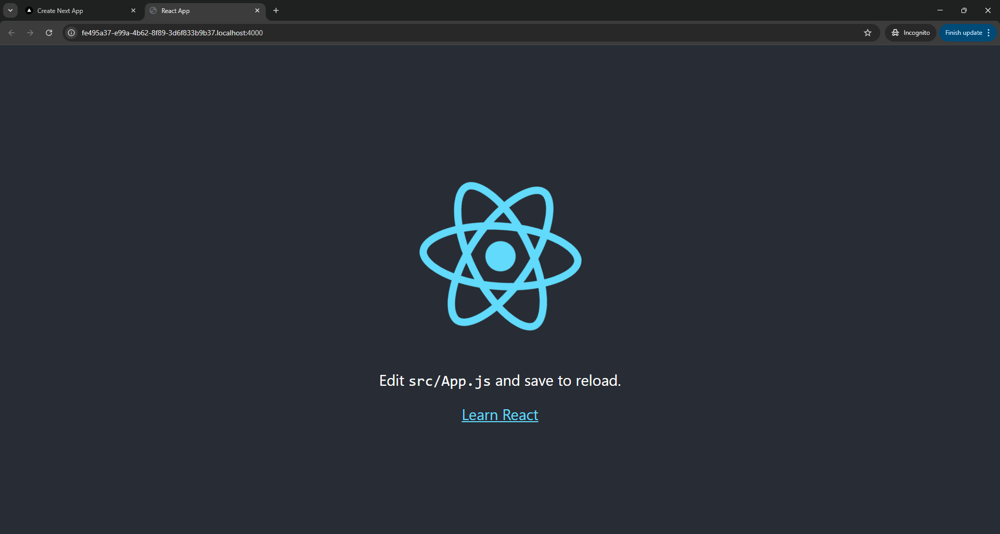

# Vercel Clone - Frontend Deployment platform

This Frontend deployement platform that <b>builds, displays real-time build logs and hosts React frontend application</b>. It takes the users' frontend public gitHub repository link and clones the source code, builds the application and generates a unique URL for the website.

## Features

- <b>Website builder:</b> User can enter their React public git repository URL, and their website will be built and deployed. They will get unique URL for their website.
- <b>Clone | Build | Deploy Logs:</b> User can see all the logs generated white building and deploying their website.

## Tech Stack

- <b>Frontend/Backend:</b> Nextjs 15
- <b>Storage and Caching:</b> Redis(Hash, List, Pub/Sub)
- <b>UI Framework:</b> Tailwind Css

## Architecture

- ### 3 microservices
    <b>Web:</b> 
    - Clones git repository URL provided by the user.
    - Makes a Socket connection to frontend that is subscribed to Redis Pub/Sub.
    - Publishes logs to Redis Pub/Sub.
    - Uploades code into AWS S3.
    - Sets current build status onto Redis hash.
    - After file upload pushes the id to Redis list.
    
    <b>Builder:</b>
    - Keeps looking for items in Redis list (Queue).
    - Downloads project files from S3.
    - Builds the application.
    - Uploads it back to S3.
    - Updates Redis hash with build complete.
    - Publishes all logs and application URL to Redis Pub/Sub.

    <b>Request Handler:</b>
    - NodeJS Express server handles HTTP requests to the deployed websites.
    - Based on the website URL server the distribution file of the deployed websites.

## Local Setup

1. Clone the repository
2. Install Dependencies
    ```bash
    npm run dev
    ```
3. Setup Redis using docker
    ```bash
    docker run --name redis-server -d -p 6379:6379 redis
    ```
4. Copy the .env.example file to .env in apps/web/, apps/builder/ and apps/request-handler/ directories.
5. Open the .env files and update your AWS_ACCESS_KEY_ID and AWS_SECRET_ACCESS_KEY.

## Project

1. Git URL Input and uploading project files (real-time logs)


2. Build logs (real-time)


3. Deployment link


4. Deployed website

